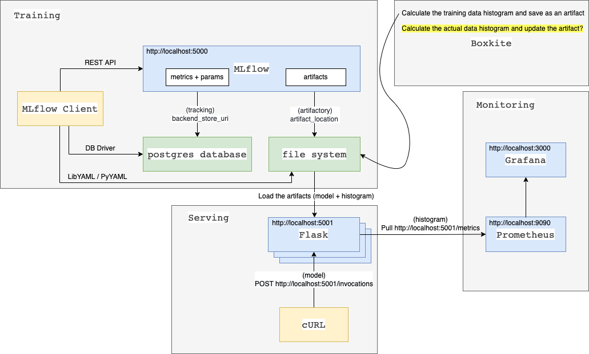

[](https://pypi.python.org/pypi/boxkite/)
[](https://pypi.python.org/pypi/boxkite/)
[](https://pypi.python.org/pypi/boxkite/)
[](https://github.com/boxkite-ml/boxkite/actions/workflows/ci.yml)
[](https://codecov.io/gh/boxkite-ml/boxkite)

_{Fast, Correct, Simple} - pick three_

# Easily compare training and production ML data & model distributions

## Goals

Boxkite is an instrumentation library designed from ground up for tracking **concept drift** in HA (Highly Available) model servers. It integrates well with existing DevOps tools (ie. Grafana, Prometheus, fluentd, kubeflow, etc.), and scales horizontally to multiple replicas with no code or infrastructure change.

- **Fast**
  - 0.5 seconds to process 1 million data points (training)
  - Sub millisecond p99 latency (serving)
  - Supports sampling for large data sets
- **Correct**
  - Aggregates histograms from multiple server replicas (using PromQL)
  - Separate counters for discrete and continuous variables (ie. categorical and numeric features)
  - Initialises serving histogram bins from training data set (based on Freedman-Diaconis rule)
  - Handles unseen data, `nan`, `None`, `inf`, and negative values
- **Simple**
  - One metric for each counter type (no confusion over which metric to choose)
  - Default configuration supports both feature and inference monitoring (easy to setup)
  - Small set of dependencies: prometheus, numpy, and fluentd
  - Extensible metric system (support for image classification coming soon)

Some non-goals of this project are:

- Adversarial detection

If you are interested in alternatives, please refer to our discussions in [FAQ](#FAQ).

## Getting Started

Follow one of our tutorials to easily get started and see how Boxkite works with other tools:

- [Prometheus & Grafana](https://boxkite.ml/en/latest/tutorials/grafana-prometheus) in Docker Compose locally
- [Kubeflow & MLflow](https://boxkite.ml/en/latest/tutorials/kubeflow-mlflow) on Kubernetes with **easy online test drive in the browser**

See [Installation](https://boxkite.ml/en/latest/installing) & [User Guide](https://boxkite.ml/en/latest/using) for how to use Boxkite in any environment.

## FAQ

1. Does boxkite support anomaly / outlier detection?

Prometheus has supported outlier detection in time series data since 2015. Once you've setup KL divergence and K-S test metrics, outlier detection can be configured on top using alerting rules. For a detailed example, refer to this tutorial: https://prometheus.io/blog/2015/06/18/practical-anomaly-detection/.

2. Does boxkite support adversarial detection?

Adversarial detection concerns with identifying single OOD (Out Of Distribution) samples rather than comparing whole distributions. The algorithms are also highly model specific. For these reasons, we do not have plans to support them in boxkite at the moment. As an alternative, you may look into Seldon for such capabilities https://github.com/SeldonIO/alibi-detect#adversarial-detection.

3. Does boxkite support concept drift detection for text / NLP models?

Not yet. This is still an actively researched area that we are keeping an eye on.

4. Does boxkite support tensorflow / pytorch?

Yes, our instrumentation library is framework agnostic. It expects input data to be a `list` or `np.array` regardless of how the model is trained.

## Contributors

The following people have contributed to the original concept and code

- [Han Qiao](https://github.com/sweatybridge)
- [Nguyen Hien Linh](https://github.com/nglinh)
- [Luke Marsden](https://github.com/lukemarsden)
- [Mariappan Ramasamy](https://github.com/Mariappan)

A full list of contributors, which includes individuals that have contributed entries, can be found [here](https://github.com/boxkite-ml/boxkite/graphs/contributors).

## Shameless plug

Boxkite is a project from BasisAI, who offer an MLOps Platform called Bedrock.

[Bedrock](https://basis-ai.com/product) helps data scientists own the end-to-end deployment of machine learning workflows. Boxkite was originally part of the Bedrock client library, but we've spun it out into an open source project so that it's useful for everyone!

## Boxkite dummy example

<p>
  
</p>

1. Create the virtual environment for this example, and install the required modules.
```bash
cd boxkite_example

python -m venv venv

pip install pip-tools
pip-compile
pip-sync
```

2. Install the postgresql for the MLflow server as "tracking_uri".
```bash
brew install postgresql

brew services start postgresql
createuser -s postgres
```

3. Initialize the postgresql for the MLflow server, and start the MLflow server.
```bash
cd mlflow

sh mlflow_init.sh
sh mlflow_start_server.sh
```

4. Check the weh UI of the MLflow server: http://localhost:5000

5. Check the postgresql DB of the MLflow "tracking_uri".
```bash
psql -U mlflow

mlflow=> \l
mlflow=> \du

mlflow=> \c mlflow
You are now connected to database "mlflow" as user "mlflow".

mlflow=> \dt
mlflow=> select * from experiments;
```

6. Train an example model, and log the trained model with its histogram in the MLflow server.
```bash
cd boxkite_example

python boxkite_example/train.py
```

7. Serve the trained model in the Flask server: http://localhost:5001
```bash
cd boxkite_example

python boxkite_example/serve.py
```

8. Query the trained model by cURL.
```bash
curl -X POST -H "Content-Type:application/json; format=pandas-split" \
  --data '{"columns":["alcohol", "chlorides", "citric acid", "density", "fixed acidity", "free sulfur dioxide", "pH", "residual sugar", "sulphates", "total sulfur dioxide", "volatile acidity"],"data":[[12.8, 0.029, 0.48, 0.98, 6.2, 29, 3.33, 1.2, 0.39, 75, 0.66]]}' \
  http://0.0.0.0:5001/invocations
```

9. The Boxkite metrics are exposed: http://localhost:5001/metrics

10. Install the Prometheus using [pre-compiled binaries](https://prometheus.io/docs/prometheus/latest/installation/)

11. Start the Prometheus server with the updated config "prometheus.yml": http://localhost:9090
```bash
./prometheus
```

```bash
scrape_configs:
  - job_name: "prometheus"
    static_configs:
      - targets: ["localhost:9090"]

  - job_name: "boxkite"
    static_configs:
      - targets: [ "localhost:5001" ]
```

12. Install the Grafana using [macOS binaries](https://grafana.com/docs/grafana/latest/installation/mac/#installing-on-macos)

13. Start the Grafana server: http://localhost:3000
```bash
./bin/grafana-server web
```

14. Configure the Prometheus data source in the Grafana server.
<p>
  
</p>

15. Create the Boxkite dashboard using the [defined model JSON](https://github.com/boxkite-ml/boxkite/blob/master/examples/grafana-prometheus/metrics/dashboards/model.json)
<p>
  
</p>

## Virtual environment

1. Use **setuptools** to package the project whose structure is as follows:
  * **pyproject.toml** - declare you want to use setuptools to package your project.
  * **setup.py** - specify your package information, such as metadata, contents, dependencies.

```
├── <dir_name>                
|   ├── <package_name>
|   |   ├── __init__.py
|   |   ├── <library_name>
|   |   |   ├── __init__.py
|   |   └── <library_name>
|   |   |   ├── __init__.py
|   ├── <tests>
|   |   ├── __init__.py
|   |   ├── <package_name>
|   |   |   ├── __init__.py
|   ├── dist
|   ├── venv
|   ├── pyproject.toml
|   ├── setup.py
```

2. Use **venv** to create and activate the virtual environment, which contains the would-be installed python packages and binaries.
```bash
python -m venv venv
source venv/bin/activate
```

3. Install **pip-tools** to compile and sync the local development environment.
```bash
pip install pip-tools

pip-compile # generate "requirements.txt"
pip-sync # install the required packages
```

4. Use **build** to build the package in the distribution directory "dist", e.g. either a "tar.gz" file or a ".whl" file.
```bash
python -m build --sdist
python -m build --wheel
```

5. Use **twine** to upload your package to PyPI.
```bash
twine upload dist/*

Uploading distributions to https://upload.pypi.org/legacy/
```

6. Use **pipdeptree** to display the direct and transitive dependencies in the virtual environment (<code>pip freeze</code> prints the currently installed packages as plain list).
```bash
pipdeptree
pipdeptree --exclude pip,setuptools,venv,pip-tools,wheel,pipdeptree,build,twine,readme-renderer --graph-output png > "dependencies.png" 
```

<p>
  
</p>

7. Check [Python Module Index](https://docs.python.org/3.9/py-modindex.html) for the built-in packages that comes with the installed python version.

8. Use **pytest** to perform the unit test for the package "boxkite_example".
```bash
cd boxkite_example

pytest
```

9. Following the above steps, create and activate the virtual environment for the package "click_example".

10. Install the "boxkite_example" package.
```bash
pip install -e ../boxkite_example
```

11. Check whether the method of "click_example" can import and use the method of "boxkite_example".
```bash
cd click_example

python click_example/app.py --start_date="2000-01-01"
```

## References
* https://blog.basis-ai.com/introducing-boxkite-open-source-model-observability-for-mlops-teams
* https://grafana.com/blog/2021/08/02/how-basisai-uses-grafana-and-prometheus-to-monitor-model-drift-in-machine-learning-workloads/  
* https://pypi.org/project/psycopg2/
* https://gist.github.com/ibraheem4/ce5ccd3e4d7a65589ce84f2a3b7c23a3
* https://setuptools.pypa.io/en/latest/userguide/quickstart.html
* https://www.mlflow.org/docs/latest/rest-api.html
* https://www.mlflow.org/docs/latest/python_api/mlflow.tracking.html
* https://www.mlflow.org/docs/latest/tracking.html
* https://www.mlflow.org/docs/latest/model-registry.html
* https://docs.pytest.org/en/6.2.x/goodpractices.html
* https://docs.pytest.org/en/6.2.x/example/index.html
* https://tox.wiki/en/latest/example/pytest.html
* https://w3techs.com/technologies/comparison/ws-gunicorn,ws-jetty,ws-nodejs
* https://medium.com/@damianmyerscough/monitoring-gunicorn-with-prometheus-789954150069

## Git

To check the **lifecycle** of the **status** of your files:
<p>
  
</p>

To check the commit history:
* git log will only show commit history below the branch you’ve checked out.
```bash
git log
git log --patch -1
git log --stat -1
git log --since=2.weeks
git log --oneline
git log --graph
git log --oneline --graph --all

git log <branch>
git log -- path/to/file

git reflog
git log -g
```

Git keeps a special pointer called HEAD to track what branch you’re currently on: 
* HEAD~ is almost linear in appearance and wants to go backward in a straight line;
* HEAD^ is the first immediate parent of the tip of the current branch.
```
G   H   I   J
 \ /     \ /
  D   E   F
   \  |  / \
    \ | /   |
     \|/    |
      B     C
       \   /
        \ /
         A

A =      = A^0
B = A^   = A^1     = A~1
C = A^2
D = A^^  = A^1^1   = A~2
E = B^2  = A^^2
F = B^3  = A^^3
G = A^^^ = A^1^1^1 = A~3
H = D^2  = B^^2    = A^^^2  = A~2^2
I = F^   = B^3^    = A^^3^
J = F^2  = B^3^2   = A^^3^2
```

<p>
  
  
</p>

```bash
git checkout -b <branch>
git branch <branch>
git checkout <branch>

git mergh <branch>
git branch -d <branch>

git branch -v
git branch --merged
git branch --no-merged
git branch --all # including the remote branches

git branch -d delete-branch-name # already merged
git branch -D delete-branch-name # not yet merged

git branch --move bad-branch-name corrected-branch-name
git push --set-upstream origin corrected-branch-name
git push -u origin corrected-branch-name
git push --delete origin bad-branch-name
```

<p>
  
  
  
  
</p>

```bash
git add <file>
git rm --cached <file>
git restore --staged <file>
git reset HEAD <file>

git reset --hard HEAD~
git reset --mixed HEAD~
git reset --soft HEAD~
git reset --hard <commit-id>

git status
git status --short
git diff # changes between staged and unstaged
git diff --staged
git diff --cached
```

To check the remote server, 'origin' is the default name Git gives to the server you cloned from:
```bash
git remote
git remote -v
git remote show <server>
git remote add <server> <url>

git remote rm <server>
git remote rename <old_server> <new_server>

git fetch <server>
git pull # fetch and merge that remote branch into your current branch
git config --global pull.rebase "false"

git push <server> <branch>
```

To check the tags:
```bash
git tag
git tag -l "0.0.3"

git tag -a <version> <commit_id>
git tag -a <version> -m "some message" # annotated tag
git tag <version> # lightweight tag
git tag -d <version>
git show <version>

git push <server> <tag>
git push <server> --delete <tag>
```

To stash a branch (staged + unstaged):
* Having a clean working directory and applying it on the same branch aren’t necessary to successfully apply a stash.
* The changes to your files were reapplied, but the file you staged before wasn’t restaged.
```bash
git stash # only the tracked files = staged + unstaged
git stash -u # including the untracked files
git stash -a # including the ignored files

git stash list

git stash apply
git stash apply stash@{2}
git stash apply --index # reapply the staged changes, so you can get back to your original position in that branch
git stash branch new-branch-name

git stash drop stash@{2}
```

<p>
  
  
  
</p>

Git rebase vs merge:
* There is no difference in the end product of the integration;
* rebasing makes for a cleaner commit history.
```bash
git checkout experiment
git rebase master
git checkout master
git merge experiment

git checkout master
git merge experiment

git reflog
git branch new-branch-name <commit-id>

git log HEAD~3..HEAD
git log -3
git rebase -i HEAD~3 # can type "edit, squash"

git commit --amend # replace the last commit with your new, improved commit.
git rebase --continue
```

## References
* https://git-scm.com/book/en/v2/Git-Tools-Reset-Demystified
* https://git-scm.com/book/en/v2/Git-Tools-Rewriting-History
* https://git-scm.com/book/en/v2/Git-Branching-Rebasing
* https://git-scm.com/book/en/v2/Git-Internals-Maintenance-and-Data-Recovery

## GitLab

GitLab Runner is an application that works with GitLab CI/CD to run jobs in a **pipeline**.
* When you register a **runner**, you must choose an **executor**, which determines the environment each **job** runs in.
* When you install GitLab Runner in a Docker container and choose the Docker executor to run your jobs, it’s sometimes referred to as a “Docker-in-Docker” configuration.
* You can configure the runner by editing the <code>$HOME/.gitlab-runner/config.toml</code> file. You can set logging, cache, concurrency, memory, CPU limits, and more.
* You can use Prometheus to monitor your runners, for the currently-running jobs and how much CPU your runners are using.

<p>
  
</p>

To install GitLab Runner on MacOS - [here](https://docs.gitlab.com/runner/install/osx.html)
```bash
brew install gitlab-runner
brew services start gitlab-runner
```

To install GitLab on MacOS - [here](https://docs.gitlab.com/ee/install/docker.html)
```bash
docker run --detach \
  --hostname gitlab.example.com \
  --publish 443:443 --publish 80:80 --publish 22:22 \
  --name gitlab \
  --restart always \
  --volume $GITLAB_HOME/config:/etc/gitlab \
  --volume $GITLAB_HOME/logs:/var/log/gitlab \
  --volume $GITLAB_HOME/data:/var/opt/gitlab \
  gitlab/gitlab-ee:latest
  
docker logs -f gitlab

docker exec -it gitlab grep 'Password:' /etc/gitlab/initial_root_password
docker exec -it gitlab /bin/bash

docker restart gitlab
docker stop gitlab
docker rm gitlab
```

```bash
cat /etc/hosts
127.0.0.1       gitlab.example.com
```

Each job contains scripts and stages:
* <code>stage</code> describes the sequential execution of jobs.
* Use the <code>rules</code> keyword to specify when to run or skip jobs.
* Keep information across jobs and stages persistent in a pipeline with <code>cache</code> and <code>artifacts</code>.

## GitLab dummy example

1. Create the dummy project in GitLab.
   
2. Register the runner with the specified URL, token and tag under the project link <code>Settings / CI/CD / Runners</code>.

```bash
gitlab-runner register
```

<p>
  
</p>

3. Check the pipeline under the project link <code>CI/CD / Pipelines</code>.

<p>
  
  
</p>

## References
* https://docs.gitlab.com/runner/

## Hook dummy example

1. Install the development packages including pre-commit.
```bash
pip-compile requirements-dev.txt --output-file=requirements-dev-compiled.txt

pip install -r requirements-dev-compiled.txt
```

2. Add a pre-commit configuration <code>.pre-commit-config.yaml</code> in the root folder.

3. Install the configuration at <code>.git/hooks/pre-commit</code>.
```bash
pre-commit install
```

4. Now <code>pre-commit</code> will run automatically on <code>git commit</code>.

## References
* https://pre-commit.com/

## Commands

To check the processes that are listening on ports:
```bash
lsof -i -P | grep LISTEN
lsof -i:22
kill -9 xxxxx
```
